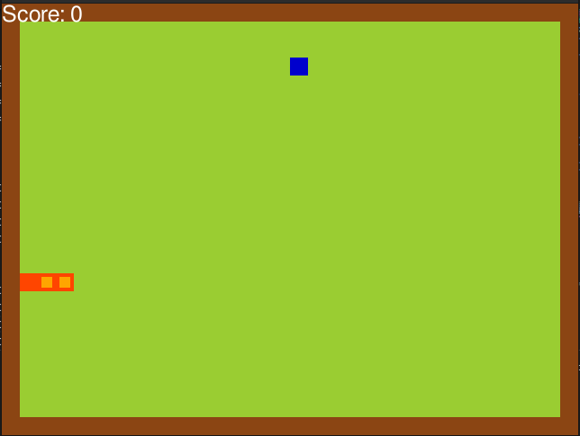

# Deep Q Learning with Snake

Deep Q learning algorithmn that plays the game of snake.

## Usage

```bash
git clone https://github.com/siabang35/Snake-Game-DQN.git
pip install -r requirements.txt
python agent.py
```
Initial game



About 100 games later ...


## Project Structure

- **agent**: Contains the agent of the game.
- **game**: This environment of the game.
- **model**: This is Deep Q learning model of the game.

## Resources

Video(https://youtu.be/oeW_49tUMp4) by  Siabang35
[Patrick Loeber](https://github.com/siabang35)
